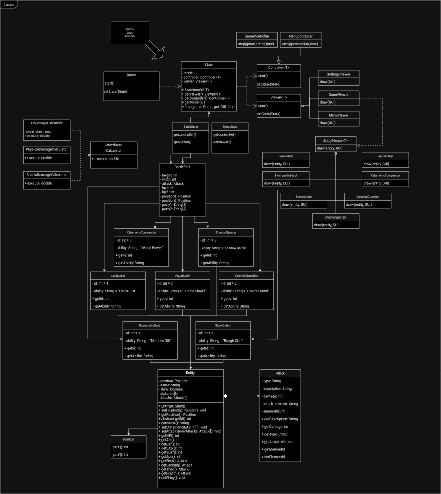

## LDTS_1303 - Pixelated Entities Tactical Showdown [P.E.T.S]

Welcome to the dazzling realm of Pixelated Entities Tactical Showdown (PETS), a riveting turn-based battle game that pits players against each other in an epic clash of strategic prowess. In this pixelated universe, you have the power to assemble a team of three extraordinary PETS, each belonging to one of seven unique types: AquaticAlly, BiomorphicBeast, CelestialGuardian, CyberneticCompanion, LavaLurker, StoneGolem, and ShadowSpecters.

Dive into the awe-inspiring world of PETS, where your tactical decisions will determine the outcome of intense battles. Each Pet boasts a distinct design, a captivating name, and a set of powerful moves, ranging from physical and special attacks to cunning status-inflicting maneuvers. Unleash the full potential of your team and outsmart your opponents with a combination of brute force, strategic planning, and a touch of elemental mastery.

The AquaticAlly, gracefully navigating water-themed attacks, can flood the battlefield with its watery might. The BiomorphicBeast, a creature of adaptability, morphs and manipulates its form to confound foes. The CelestialGuardian, with celestial energy at its disposal, bestows divine buffs upon its allies while smiting enemies with holy wrath. The CyberneticCompanion, a fusion of technology and loyalty, utilizes advanced gadgets to control the flow of battle. The LavaLurker, a fiery force from the depths, engulfs adversaries with molten fury. The StoneGolem, an unyielding colossus, relies on rugged defense and earth-shaking blows. Lastly, the elusive ShadowSpecters harness the power of darkness, weaving in and out of the shadows to confound and strike at will.

Beyond their diverse move sets, each type of PETS possesses unique abilities tied to their elemental nature. Whether it's a defensive buff, a critical hit bonus, or a status ailment immunity, these abilities add an extra layer of strategy to your team-building and battle tactics.

Engage in thrilling battles, challenge friends, and climb the ranks to become the ultimate PETS champion. Choose your team wisely, master the strengths and weaknesses of each type, and embark on an adventure where pixelated entities come to life in a tactical showdown like never before! Are you ready to unleash the power of your PETS?

This project was developed by Afonso Mansilha (up202206002@up.pt), Eduardo Cruz (up202205138@up.pt) e Rodrigo de Sousa (up202205751@up.pt) for LDTS 2023⁄24.

## UML Class Diagram

A UML class diagram showcasing used Design Patterns:

### IMPLEMENTED FEATURES

- **Choose Your Own Team** - Each Player can create their dream Team by picking their favourites from the great Pet selection.
- **Startegy is Key** - Different Pets will have their unique traits which can decide the outcome of the battle, attacks giving twice the damage or even abilities.
- **Alone or With Friends** - The Battles can be fought agaisnt Friends in a PVP Battle or Practice against CPU.

### PLANNED FEATURES

- Actual Playable Battles where the User selects three Pets with predetermined moves;
- How To Play section;
- Play agaisnt a CPU;

### DESIGN

#### KNOWN CODE SMELLS

> This section should describe 3 to 5 different code smells that you have identified in your current implementation.

### TESTING

Only Unit Testing for Enitity creation and Damage calculation.

### SELF-EVALUATION

- Afonso Mansilha =
- Eduardo Cruz = 
- Rodrigo de Sousa =
