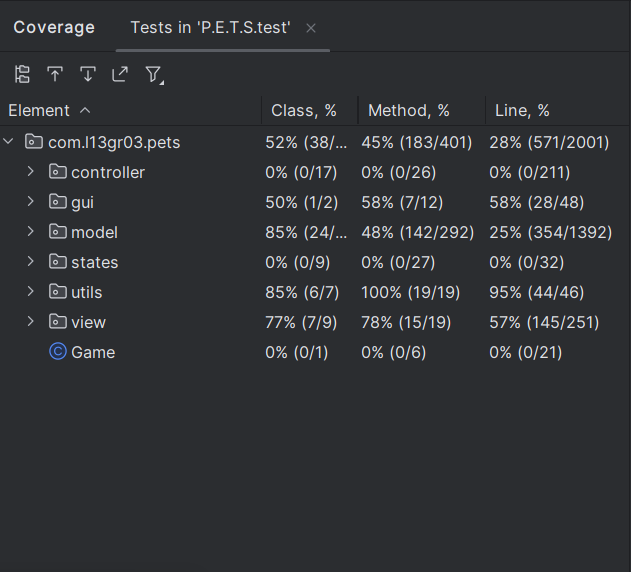
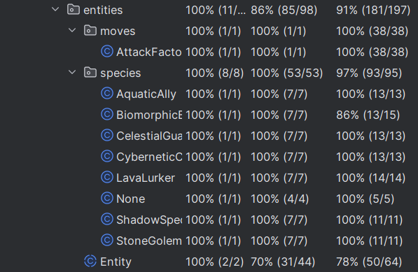
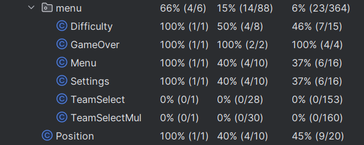
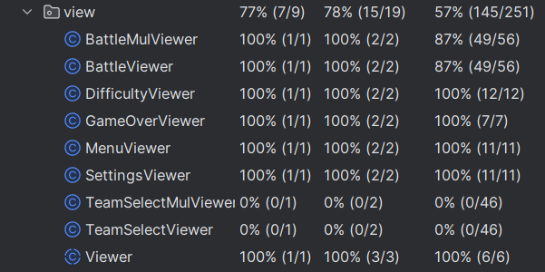

# **REPORT**

## LDTS_1303 - Pixelated Entities Tactical Showdown [P.E.T.S]

Welcome to the dazzling realm of Pixelated Entities Tactical Showdown (PETS), a riveting turn-based battle game that pits players against each other in an epic clash of strategic prowess. In this pixelated universe, you have the power to assemble a team of three extraordinary PETS, each belonging to one of seven unique types: AquaticAlly, BiomorphicBeast, CelestialGuardian, CyberneticCompanion, LavaLurker, StoneGolem, and ShadowSpecters.


This project was developed for LDTS 2023⁄24 by:
- Afonso Mansilha (up202206002@up.pt),
- Eduardo Cruz (up202205138@up.pt),
- Rodrigo de Sousa (up202205751@up.pt)
## Table of contents
1. [Description](#description)
   1. [Controls](#controls)
   2. [Media](#media)
2. [Implemented Features](#implemented-features)
3. [Planned Features](#planned-features)
4. [Design](#design---problems-and-solutions)
   1. [Architectural Structuring](#architectural-structuring)
   2. [Entities and Parties](#entities-and-parties)
   3. [Turn Based Game - Multiple Rounds](#turn-based-game---multiple-rounds)
   4. [Turn Based Game - Order](#turn-based-game---order)
   5. [Attack Types and Their Damage](#attack-types-and-their-damage)
5. [UML Class Diagram](#uml-class-diagram)
6. [Known Code Smells](#known-code-smells)
7. [Testing](#testing)
8. [Self-evaluation](#self-evaluation)


## Description

Dive into the awe-inspiring world of PETS, where your tactical decisions will determine the outcome of intense battles. Each Pet boasts a distinct design, a captivating name, and a set of powerful moves, ranging from physical and special attacks to cunning status-inflicting maneuvers. Unleash the full potential of your team and outsmart your opponents with a combination of brute force, strategic planning, and a touch of elemental mastery.

Blastem, a joyful AquaticAlly, gracefully navigating water-themed attacks, can flood the battlefield with its watery might. Angree, a tempestuous BiomorphicBeast, morphs as a tree and manipulates its form to confound foes. Doxxis, an alien CelestialGuardian, with celestial energy at its disposal, bestows divine buffs upon its allies while smiting enemies with otherworldly wrath. Metagrosso, the bulkiest of the CyberneticCompanions, utilizes advanced gadgets to control the flow of battle. Nekizal, a cocky LavaLurker, engulfs adversaries with molten fury.  Nocturnyx, the elusive ShadowSpecters harness the power of darkness, weaving in and out of the shadows to confound and strike at will. Lastly, Big7, the mighty StoneGolem, an unyielding colossus, relies on rugged defense and earth-shaking blows.

Beyond their diverse move sets, each type of PETS possesses unique abilities tied to their elemental nature. Whether it's a defensive buff, a critical hit bonus, or a status ailment immunity, these abilities add an extra layer of strategy to your team-building and battle tactics.

Engage in thrilling battles, challenge friends, and climb the ranks to become the ultimate PETS champion. Choose your team wisely, master the strengths and weaknesses of each type, and embark on an adventure where pixelated entities come to life in a tactical showdown like never before! Are you ready to unleash the power of your PETS?

### CONTROLS

The game is played using the `arrow keys` to move the cursor to the intended action.
### MEDIA
#### Menus
| Main Menu                 |
|---------------------------|
|  |

| Team Select (Hovering Pet)       | Team Select (Hovering None)      |
|----------------------------------|----------------------------------|
|  |  | 

#### Pets
| Blastem                             | Angree                            | Metagrosso                                | Doxxis                            | Nekizal                             | Nocturnyx                               | Big7                          |
|-------------------------------------|-----------------------------------|-------------------------------------------|-----------------------------------|-------------------------------------|-----------------------------------------|-------------------------------|
|  |  |  |  |  |  |  |


## IMPLEMENTED FEATURES

- **Choose Your Own Team** - Each Player can create their dream Team by picking their favourites from the great Pet selection.
- **Startegy is Key** - Different Pets will have their unique traits which can decide the outcome of the battle, attacks giving twice the damage or even abilities.
- **Single-Player Friendly** - The Battles can be fought against a CPU with custom difficulty.
- **Play With Friends** - Challenge your friends for an epic 1V1 Battle!

## PLANNED FEATURES

Everything Is Done

## DESIGN - Problems and Solutions

### Architectural Structuring
#### Problem in Context:
We needed a way to structure the project, separating the data, interface and control of the game.
This way we could have an improved way to implement new features.
#### The Pattern:
We opted for two patterns for the project, the the **MVC Architectural Pattern**,
which is commonly used in a GUI and the **State Pattern** which is a behavioral design pattern that lets an object alter its behavior when its internal state changes.
#### Implementation:
We have the data storing classes in the model package, the logic manipulator classes of the game in the controller package,
the visual effect creator classes in the view package and their respective states also on a separate package.

These are the main divisions of the project, having also created a utils package that we will discuss further on.
> See the [Class UML](#uml-class-diagram) and note the coloured boxes.
#### Consequences:
The code becomes much better structured and easy to work on, being adding features or fixing bugs.

### Entities and Parties
#### Problem in Context:

In our game, each Pet has a type that affects their stats, attacks and abilities, but we don't want to have to deal
with every class differently because in essence, they are all entities. Also, we have are using them as an element only,
a Party.

#### The Pattern:

Using the  **Composition Pattern** we can have an Abstract Entity class and the various other Pet Species, and also a Party
class that aggregates 3 Pets as a single object.
#### Implementation:
We created the Abstract Entity and the other classes that implement it, as well as a Party class.
>See the [Class UML](#uml-class-diagram) and note in the Model box the Enitity-Party Relation and the Entity-Entities Relation.

#### Consequences:
We can treat all Pets as equals for most of the actions in the game, and group them in a simple Party object.
It also allows for SOLID design as the Liskov Substitution Principle applies.
### Turn Based Game - Multiple Rounds
#### Problem in Context:

Since this is a Turn-Based Game, having turns is crucial to the functioning of the game. We needed a way to have different
rounds being created everytime an action was chosen.

#### The Pattern:
We made the Round class a **Composition** from the Battlefield. Battlefield works as a **Round Factory**.
#### Implementation:
Battlefield initiates a new Round object every round with the information needed.
>See the [Class UML](#uml-class-diagram) and note the Battlefield-Round Composite Relation.
#### Consequences:
The Rounds are treated as a Unit, which makes the Game-Loop pattern flow much better.
### Turn Based Game - Order
#### Problem in Context:
Since they take turns attacking each other, there has to be an order at which they do their actions. Speed was chosen as the
criteria but what happens when both have the same speed, it has to be random.
A Random and Customizable Calculator was needed.
#### The Pattern:
We used the **Strategy Pattern**, by creating a Randomizer Interface and then Classes that we can call as object to serve as the random function.

#### Implementation:
Randomizer Interface and Classes that implement it.
>See the [Class UML](#uml-class-diagram) and note in the Utils box the Randomizers.
#### Consequences:
This allows us to use random numbers but still be able to manipulate them in certain cases.
This makes use of SOLID design as allows for the Interface Segregation Principle.
### Attack types and Their Damage
#### Problem in Context:
Each Pet has different attacks that deal different damage depending on the attack element, defender's element, attack type and defender's stats.
That would require a lot of switch cases and if clauses in the Round's class.

#### The Pattern:
We used the **Command Pattern** to create Calculators of specific kinds for each of our needs.
#### Implementation:
Creating a Calculator Interface using the Command Pattern to calculate Physical Damage, Special Damage or Advantage, simplifying the whole process.
>See the [Class UML](#uml-class-diagram) and note in the Utils box the Calculators.
#### Consequences:
This allows us to simplify the Battlefield and Round class, while also keeping SOLID design, such as the Single Responsibility Principle and Open-Closed Principle.


## UML Class Diagram

A UML Class diagram showcasing used Design Patterns:


## KNOWN CODE SMELLS

The Multiplayer Mode uses a new Model, State, Controller and Viewer instead of using the same as the Singleplayer Mode.
However, they barely have any changes. We did this because they serve different purposes, as per the Single Responsibility Principle,
we thought it is best we separate them.

## TESTING

### Coverage



#### Coverage for Model




#### Coverage for View


### Pitest

The Pitest Reports can be found [here](../reports/pit)
```
================================================================================
- Statistics
================================================================================
>> Line Coverage (for mutated classes only): 992/2560 (39%)
>> Generated 1697 mutations Killed 194 (11%)
>> Mutations with no coverage 1065. Test strength 31%
>> Ran 722 tests (0.43 tests per mutation)
```

### SELF-EVALUATION
Everyone invested their time and skill making this project, and seeing it run made it all worth it.
Each of us worked on different parts of the project independently, as well as together giving each 
other important insight. We consider it a valuable experience, as it improved our java and 
principle/pattern skills, as well as our team work. It may not be the best work, but we gave it **our best**.

- Afonso Mansilha = 1/3
- Eduardo Cruz = 1/3
- Rodrigo de Sousa = 1/3
