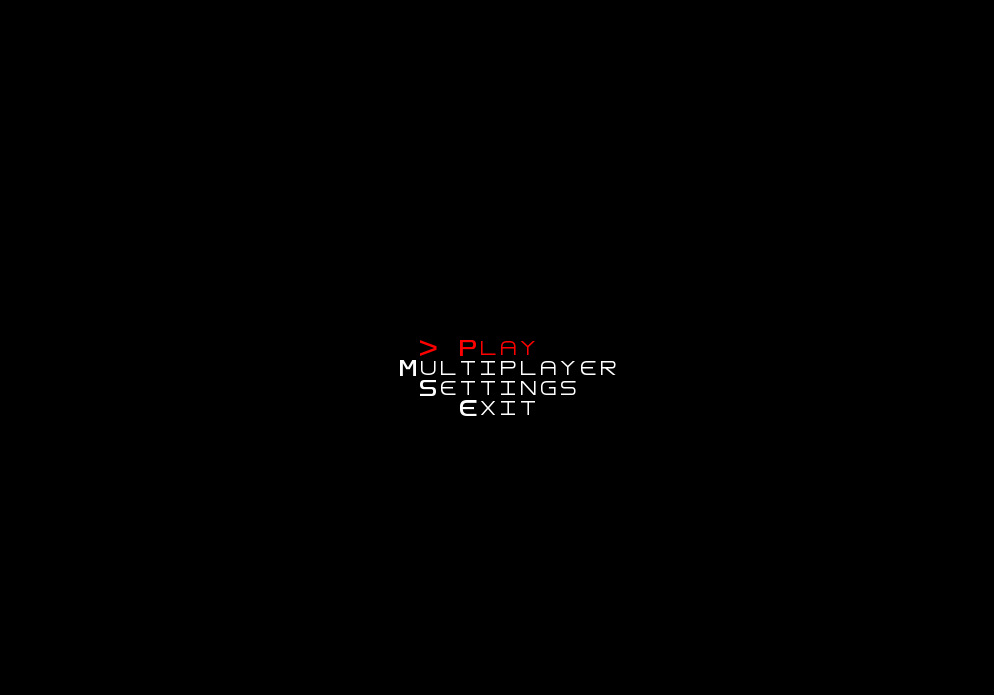
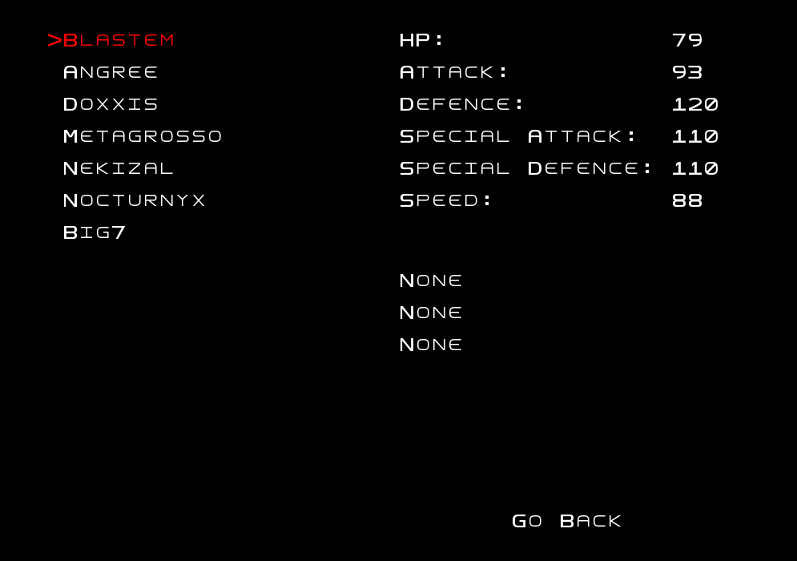
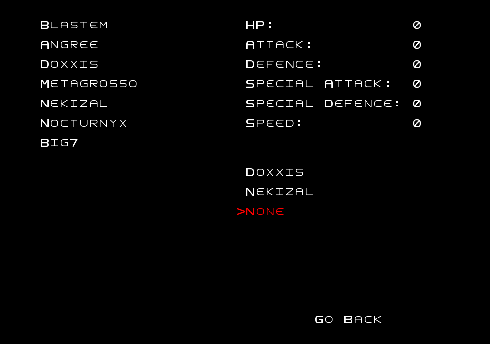
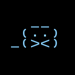
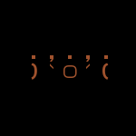
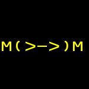
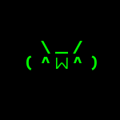
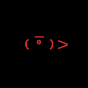
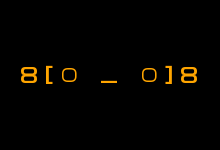
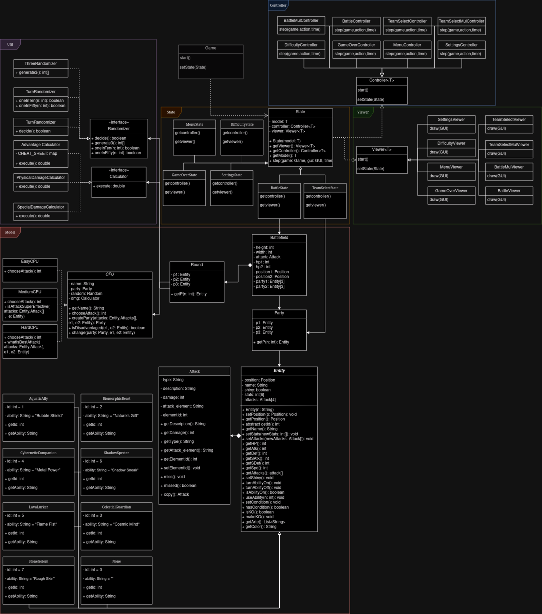

## LDTS_1303 - Pixelated Entities Tactical Showdown [P.E.T.S]

Welcome to the dazzling realm of Pixelated Entities Tactical Showdown (PETS), a riveting turn-based battle game that pits players against each other in an epic clash of strategic prowess. In this pixelated universe, you have the power to assemble a team of three extraordinary PETS, each belonging to one of seven unique types: AquaticAlly, BiomorphicBeast, CelestialGuardian, CyberneticCompanion, LavaLurker, StoneGolem, and ShadowSpecters.

This project was developed for LDTS 2023⁄24 by:
- Afonso Mansilha (up202206002@up.pt),
- Eduardo Cruz (up202205138@up.pt),
- Rodrigo de Sousa (up202205751@up.pt)
## Table of contents
1. [Description](#description)
    1. [Controls](#controls)
    2. [Media](#media)
2. [Implemented features](#implemented-features)
3. [Planned features](#planned-features)
4. [Design](#design)
    1. [Lanterna facade](#lanterna-facade)
    2. [ElementView factory](#factory-elementview)
    3. [ViewFactory](#factory-view)
    4. [ArenaModelLoaderStream factory](#factory-arenamodelloaderstream)
    5. [Menus and games](#state-game)
    6. [ArenaController is the *God of Dynamics*](#command-composite-arenacontroller)
    7. [Movement strategies](#strategy-movement)
    8. [Composite Views](#composite-view)
5. [Code smells and refactoring suggestions](#code-smells)
6. [Testing](#testing)
7. [Self-evaluation](#self-evaluation)

<a name="description"><a/>
## Description

Dive into the awe-inspiring world of PETS, where your tactical decisions will determine the outcome of intense battles. Each Pet boasts a distinct design, a captivating name, and a set of powerful moves, ranging from physical and special attacks to cunning status-inflicting maneuvers. Unleash the full potential of your team and outsmart your opponents with a combination of brute force, strategic planning, and a touch of elemental mastery.

Blastem, a joyful AquaticAlly, gracefully navigating water-themed attacks, can flood the battlefield with its watery might. Angree, a tempestuous BiomorphicBeast, morphs as a tree and manipulates its form to confound foes. Doxxis, an alien CelestialGuardian, with celestial energy at its disposal, bestows divine buffs upon its allies while smiting enemies with otherworldly wrath. Metagrosso, the bulkiest of the CyberneticCompanions, utilizes advanced gadgets to control the flow of battle. Nekizal, a cocky LavaLurker, engulfs adversaries with molten fury.  Nocturnyx, the elusive ShadowSpecters harness the power of darkness, weaving in and out of the shadows to confound and strike at will. Lastly, Big7, the mighty StoneGolem, an unyielding colossus, relies on rugged defense and earth-shaking blows.

Beyond their diverse move sets, each type of PETS possesses unique abilities tied to their elemental nature. Whether it's a defensive buff, a critical hit bonus, or a status ailment immunity, these abilities add an extra layer of strategy to your team-building and battle tactics.

Engage in thrilling battles, challenge friends, and climb the ranks to become the ultimate PETS champion. Choose your team wisely, master the strengths and weaknesses of each type, and embark on an adventure where pixelated entities come to life in a tactical showdown like never before! Are you ready to unleash the power of your PETS?

<a name="controls"><a/>
### CONTROLS

The game is played using the `arrow keys` to move the cursor to the intended action.
<a name="media"><a/>
### MEDIA
<a name="galery"><a/>
#### Menus
| Main Menu                 |
|---------------------------|
|  |

| Team Select (Hovering Pet)       | Team Select (Hovering None)      |
|----------------------------------|----------------------------------|
|  |  | 

#### Pets
| Blastem                             | Angree                            | Metagrosso                                | Doxxis                            | Nekizal                             | Nocturnyx                               | Big7                          |
|-------------------------------------|-----------------------------------|-------------------------------------------|-----------------------------------|-------------------------------------|-----------------------------------------|-------------------------------|
|  |  |  |  |  |  |  |

## IMPLEMENTED FEATURES

- **Choose Your Own Team** - Each Player can create their dream Team by picking their favourites from the great Pet selection.
- **Startegy is Key** - Different Pets will have their unique traits which can decide the outcome of the battle, attacks giving twice the damage or even abilities.
- **Single-Player Friendly** - The Battles can be fought against a CPU with custom difficulty.
- **Play With Friends** - Challenge your friends for an epic 1V1 Battle!

## PLANNED FEATURES

Everything Is Done

## DESIGN

### Multiple Entities
Problem at Hand:

In our game, each Pet has a type that affects their stats, attacks and abilities, but we don't want to have to deal
with every class differently because in essence, they are all entities.

Solution:

Design Pattern -> IDK THE NAME 
Thus, we created an Abstract class called Entity and all the different entities  extend that same class, making it
very simple to handle.

### Turn Based Game - Multiple Rounds
Problem at Hand:

Since this is a Turn-Based Game, having turns is crucial to the functioning of the game. We needed a way to have different
rounds being created everytime an action was chosen.

Solution:

Our Battlefield class works as a RoundFactory where everytime an action is chosen, it creates a new Round with all the 
things that were chosen.
### Turn Based Game - Order
Problem at Hand:

Since they take turns attacking each other, there has to be an order at which they do their actions. Speed was chosen as the
criteria but what happens when both have the same speed, it has to be random.

Solution:

Creating a Randomizer Interface and classes that implement it to choose everything that works at random, being lucky hits,
who attacks first when having the same speed. This also allows us to force random events to happen since we control the randomizer,
as opposed to using the java util random.

### Attack types and Their Damage
Problem at Hand:

Each Pet has different attacks that deal different damage depending on the attack element, defender's element, attack type and defender's stats.
That would require a lot of switch cases and if clauses in the Round's class.

Solution:

### Missing attacks and switching
### MVC
### Lanterna

### UML Class Diagram

A UML Class diagram showcasing used Design Patterns:

### UML Sequence Diagram

A UML Sequence diagram showcasing the flow of the program:

### UML State Diagram

A 

#### KNOWN CODE SMELLS

The Multiplayer Mode uses a new Model, State, Controller and Viewer instead of using the same as the Singleplayer Mode.
However, they barely have any changes but we did this because they serve different purposes, as per the Single Responsibility Principle.

### TESTING

### SELF-EVALUATION
Everyone invested their time and skill making this project, and seeing it run made it all worth it.
Each of us worked on different parts of the project independently, as well as together giving each 
other important insight. We consider it a valuable experience, as it improved our java and 
principle/pattern skills, as well as our team work

- Afonso Mansilha = 1/3
- Eduardo Cruz = 1/3
- Rodrigo de Sousa = 1/3
